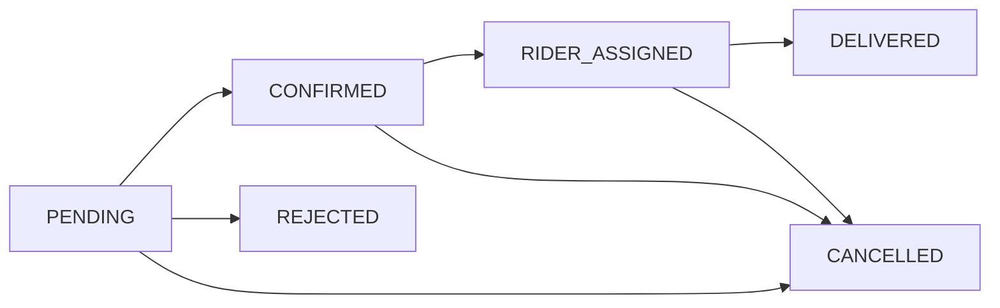

## Introduction

The Bookings API allows users to create and manage delivery bookings (orders) within the DPM Delivery system. Bookings represent orders placed by users at specific places, containing one or more products/services to be delivered to a recipient address.

## Booking Lifecycle

Bookings follow a defined state transition flow:

### Booking States

<ParamField path="pending" type="string">
  Initial state when a booking is created. Awaiting confirmation from the place admin.
</ParamField>

<ParamField path="confirmed" type="string">
  Place admin has confirmed the booking and is preparing the order.
</ParamField>

<ParamField path="rider_assigned" type="string">
  A rider has been assigned to deliver the booking.
</ParamField>

<ParamField path="delivered" type="string">
  The booking has been successfully delivered to the recipient.
</ParamField>

<ParamField path="cancelled" type="string">
  The booking was cancelled by an admin or place admin.
</ParamField>

<ParamField path="rejected" type="string">
  The booking was rejected by the place admin or user.
</ParamField>

## Booking Structure

A booking contains the following key information:

- **Place**: The place (restaurant, shop, etc.) where the order is placed
- **Services/Products**: Array of ordered products with quantities and prices
- **Delivery Details**: Recipient address, phone number, delivery fee, and optional rider tip
- **Payment Information**: Transaction ID, request ID, reference code, payment status
- **Status**: Current state in the booking lifecycle
- **User**: The customer who created the booking

## Key Concepts

### Ordered Products

Each booking can contain multiple products/services from the same place. Each ordered product includes:
- Product ID reference
- Quantity ordered
- Price per unit
- Associated place ID

### Payment Integration

Bookings are created after successful payment. Each booking requires:
- `transaction_id`: Unique payment transaction identifier
- `request_id`: Payment request identifier
- `reference_code`: Generated reference for the booking
- `receipt_url`: Optional payment receipt URL
- `paid`: Boolean flag indicating payment status

### Pricing Breakdown

- **price**: Base price of products/services
- **delivery_fee**: Fee for delivery service
- **rider_tip**: Optional tip for the delivery rider
- **total_amount**: Sum of all costs

## Role-Based Access

Different user roles have different permissions for booking operations:

- **User**: Can create bookings, view their own bookings, delete their bookings, rate delivered bookings
- **Place Admin**: Can view bookings for their place, confirm/cancel/reject/deliver bookings
- **Admin (Super Admin)**: Full access to all booking operations, can view all bookings with advanced filtering

## Next Steps

<CardGroup cols={2}>
  <Card title="Create Booking" icon="plus" href="/api/bookings/create">
    Learn how to create a new booking
  </Card>
  <Card title="Manage Bookings" icon="list-check" href="/api/bookings/manage">
    View, update, and manage bookings
  </Card>
  <Card title="Rate Bookings" icon="star" href="/api/bookings/ratings">
    Submit ratings after delivery
  </Card>
</CardGroup>
