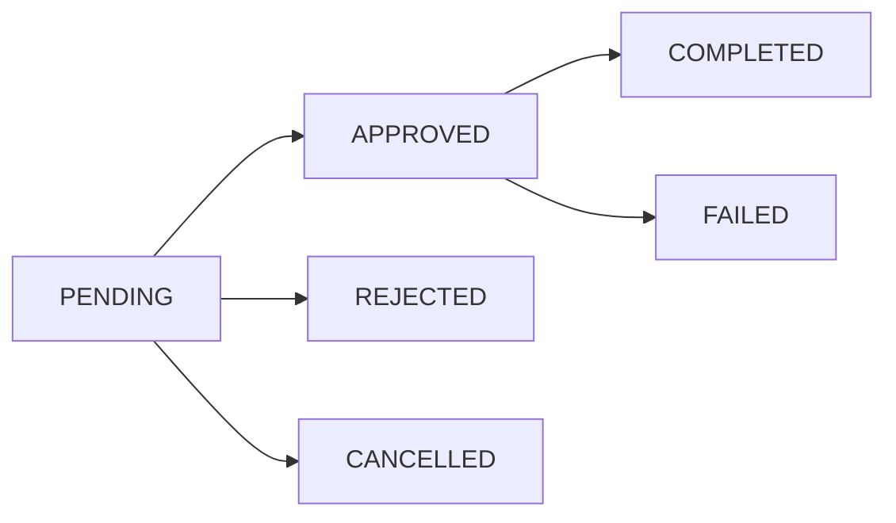

## Introduction

The DPM Delivery platform includes a digital wallet system for riders to manage their earnings. Riders accumulate delivery payments in their wallet and can request payouts through mobile money or bank transfers.

## Wallet Features

<CardGroup cols={2}>
  <Card title="Balance Tracking" icon="wallet">
    Real-time balance and earnings history
  </Card>
  <Card title="Payout Requests" icon="money-bill-transfer">
    Request withdrawals via mobile money or bank
  </Card>
  <Card title="Transaction History" icon="list">
    Complete audit trail of all transactions
  </Card>
  <Card title="Admin Controls" icon="shield">
    Admin approval workflow for payouts
  </Card>
</CardGroup>

## Wallet Entity

Each rider has a wallet with the following properties:

<ResponseField name="id" type="string">
  Unique wallet identifier (UUID)
</ResponseField>

<ResponseField name="balance" type="decimal">
  Current available balance
</ResponseField>

<ResponseField name="totalEarned" type="decimal">
  Total lifetime earnings
</ResponseField>

<ResponseField name="user" type="User">
  Associated rider/user
</ResponseField>

<ResponseField name="transactions" type="WalletTransaction[]">
  List of all wallet transactions
</ResponseField>

<ResponseField name="payoutRequests" type="PayoutRequest[]">
  List of payout requests
</ResponseField>

Entity definition: `/home/daytona/workspace/source/src/wallets/entities/wallets.entity.ts:7`

## Transaction Types

Wallet transactions are categorized by type:

```typescript
enum WalletTransactionTypes {
  PAYMENT_RECEIVED = 'payment_received',    // Customer payment received
  WITHDRAWAL = 'withdrawal',                 // Successful payout
  DEBIT = 'debit',                          // Manual debit
  ADJUSTMENT = 'adjustment',                 // Balance adjustment
  PAYOUT_PENDING = 'payout_pending',        // Payout request created
  PAYOUT_REJECTED = 'payout_rejected',      // Payout rejected
  PAYOUT_FAILED = 'payout_failed',          // Payout failed
  PAYOUT_APPROVED = 'payout_approved'       // Payout approved
}
```

## Payout Methods

Riders can request payouts through two methods:

### Mobile Money

Direct transfer to mobile money account:

<ParamField path="payoutMethod" type="enum">
  Set to `MOBILE_MONEY`
</ParamField>

<ParamField path="mobileMoneyProvider" type="string" required>
  Provider name (e.g., `MTN`, `Vodafone`, `AirtelTigo`)
</ParamField>

<ParamField path="mobileMoneyNumber" type="string" required>
  Mobile money account number
</ParamField>

<ParamField path="mobileMoneyAccountName" type="string" required>
  Account holder name
</ParamField>

### Bank Transfer

Transfer to bank account:

<ParamField path="payoutMethod" type="enum">
  Set to `BANK_TRANSFER`
</ParamField>

<ParamField path="accountNumber" type="string" required>
  Bank account number
</ParamField>

<ParamField path="accountName" type="string" required>
  Account holder name
</ParamField>

<ParamField path="bankName" type="string" required>
  Name of the bank
</ParamField>

<ParamField path="bankCode" type="string">
  Bank code (optional)
</ParamField>

## Payout Request Lifecycle

Payout requests go through the following statuses:



### Status Definitions

<ResponseField name="PENDING" type="status">
  Request created, awaiting admin review
</ResponseField>

<ResponseField name="APPROVED" type="status">
  Admin approved, ready for processing
</ResponseField>

<ResponseField name="COMPLETED" type="status">
  Payout successfully processed and sent
</ResponseField>

<ResponseField name="REJECTED" type="status">
  Admin rejected the request
</ResponseField>

<ResponseField name="CANCELLED" type="status">
  Rider cancelled the request
</ResponseField>

<ResponseField name="FAILED" type="status">
  Payout processing failed
</ResponseField>

## Wallet Operations

The wallet service provides the following internal operations:

### Credit Wallet

Adds funds to a rider's wallet (called when customer pays for delivery):

```typescript
async creditWallet(userId: string, amount: number, reference: string)
```

- Creates wallet if it doesn't exist
- Updates balance and totalEarned
- Creates `PAYMENT_RECEIVED` transaction record

Implementation: `/home/daytona/workspace/source/src/wallets/wallets.service.ts:39`

### Debit Wallet

Removes funds from a rider's wallet:

```typescript
async debitWallet(userId: string, amount: number, reference: string)
```

- Validates sufficient balance
- Updates balance and totalEarned
- Creates `DEBIT` transaction record
- Throws error if insufficient balance

Implementation: `/home/daytona/workspace/source/src/wallets/wallets.service.ts:72`

### Get Wallet by User ID

Retrieve a rider's wallet:

```typescript
async getWalletByUserId(userId: string): Promise<Wallet>
```

### Get Wallet Transactions

Retrieve paginated transaction history:

```typescript
async getWalletTransactions(userId: string, queries: GetTransactionsDto)
```

<ParamField query="page" type="number" default="1">
  Page number for pagination
</ParamField>

<ParamField query="limit" type="number" default="10">
  Number of records per page
</ParamField>

<ParamField query="type" type="WalletTransactionTypes">
  Filter by transaction type
</ParamField>

## Processing Fees

Payout requests include a processing fee:

- **Fee Percentage**: 1% of the requested amount
- **Net Amount**: `requestedAmount - processingFee`

Example:
```typescript
const PROCESSING_FEE_PERCENTAGE = 0.01; // 1%
const processingFee = amount * PROCESSING_FEE_PERCENTAGE;
const netAmount = amount - processingFee;
```

Implementation: `/home/daytona/workspace/source/src/wallets/wallets.service.ts:239`

## Minimum Withdrawal

The system enforces a minimum withdrawal amount:

<Note>
  **Minimum Withdrawal Amount**: GHS 10.00
</Note>

Requests below this threshold will be rejected.

## Transaction Safety

All wallet operations use database transactions to ensure data integrity:

- Credit/debit operations are atomic
- Payout requests lock wallet balance
- Failed operations are rolled back automatically
- Concurrent requests are handled safely

## Security Features

<AccordionGroup>
  <Accordion title="IP Tracking">
    All payout requests track the originating IP address for security auditing.
  </Accordion>
  
  <Accordion title="Single Pending Request">
    Riders can only have one pending payout request at a time to prevent fraud.
  </Accordion>
  
  <Accordion title="Balance Verification">
    Balance is re-verified during admin approval to prevent double-spending.
  </Accordion>
  
  <Accordion title="Audit Trail">
    Complete audit trail with timestamps for all status changes.
  </Accordion>
</AccordionGroup>

## Next Steps

<CardGroup cols={2}>
  <Card title="Wallet Transactions" icon="arrow-right" href="/api/wallets/transactions">
    Learn about transaction operations
  </Card>
  <Card title="Payment Integration" icon="credit-card" href="/api/payments/integration">
    Understand payment processing
  </Card>
</CardGroup>