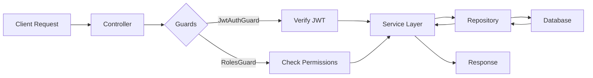

## Overview

The DPM Delivery API is built on **NestJS**, a progressive Node.js framework that provides a robust, scalable architecture. The application follows a modular design pattern where each feature is encapsulated in its own module with clear separation of concerns.

## Technology Stack

- **Framework**: NestJS (TypeScript)
- **ORM**: TypeORM
- **Authentication**: JWT (JSON Web Tokens)
- **Scheduling**: NestJS Schedule Module
- **Database**: PostgreSQL (via TypeORM)

## Core Architecture

### Module Structure

The application is organized into feature-based modules, each responsible for a specific domain:

<CardGroup cols={2}>
  <Card title="Auth Module" icon="lock">
    Handles authentication, JWT token management, and user verification
  </Card>
  <Card title="Users Module" icon="users">
    Manages user accounts, roles, and profiles
  </Card>
  <Card title="Bookings Module" icon="calendar">
    Processes orders for restaurant/place deliveries
  </Card>
  <Card title="Shipping Module" icon="truck">
    Manages parcel delivery orders and tracking
  </Card>
  <Card title="Riders Module" icon="motorcycle">
    Handles courier/rider profiles and assignments
  </Card>
  <Card title="Wallets Module" icon="wallet">
    Manages rider wallets, payouts, and transactions
  </Card>
  <Card title="Places Module" icon="store">
    Manages restaurants and stores
  </Card>
  <Card title="Products Module" icon="box">
    Handles product catalog and ordering
  </Card>
  <Card title="Payment Module" icon="credit-card">
    Integrates payment processing (Mobile Money, Bank)
  </Card>
  <Card title="Messages Module" icon="message">
    Sends SMS notifications via templates
  </Card>
  <Card title="Analytics Module" icon="chart-line">
    Provides business insights and reports
  </Card>
  <Card title="Crons Module" icon="clock">
    Handles scheduled tasks and automation
  </Card>
</CardGroup>

### Root Module Configuration

The application initializes in `app.module.ts:35-75` with global configurations:

```typescript
@Module({
  imports: [
    ConfigModule.forRoot({ isGlobal: true }),
    TypeOrmModule.forRootAsync({
      useClass: DatabaseConnectionService,
    }),
    JwtModule.register({
      global: true,
      secret: process.env.JWT_SECRET,
      signOptions: { expiresIn: '365 days' },
    }),
    ScheduleModule.forRoot(),
    // Feature modules
    AuthModule,
    UsersModule,
    BookingsModule,
    ShippingModule,
    RiderModule,
    WalletsModule,
    // ... other modules
  ],
})
export class AppModule {}
```

<Note>
  The JWT module is registered globally with a 365-day token expiration, allowing authenticated requests across all modules.
</Note>

## Data Flow

### Request Processing Pipeline



### Layer Responsibilities

<Accordion title="Controllers">
  **Location**: `src/*/*.controller.ts`
  
  Controllers handle HTTP requests and route them to appropriate services. They:
  - Define API endpoints and HTTP methods
  - Apply guards for authentication and authorization
  - Validate request DTOs
  - Return formatted responses
  
  Example from `bookings.controller.ts`:
  ```typescript
  @Controller('bookings')
  @UseGuards(JwtAuthGuard, RolesGuard)
  export class BookingsController {
    @Post()
    @hasRoles(UserRoles.USER)
    create(@Body() dto: CreateBookingDto, @CurrentUser() user: User) {
      return this.bookingsService.create(dto, user);
    }
  }
  ```
</Accordion>

<Accordion title="Services">
  **Location**: `src/*/*.service.ts`
  
  Services contain business logic and orchestrate operations. They:
  - Implement core business rules
  - Coordinate between multiple repositories
  - Handle transactions and error handling
  - Integrate with external services (SMS, payment gateways)
  
  Example from `bookings.service.ts:51-142`:
  ```typescript
  @Injectable()
  export class BookingsService {
    constructor(
      @InjectRepository(Booking)
      private readonly bookingRepository: Repository<Booking>,
      private readonly placeService: PlacesService,
      private readonly messageService: MessagesService,
    ) {}
    
    async create(dto: CreateBookingDto, user: User) {
      // Business logic: validate place hours, create booking, send notifications
    }
  }
  ```
</Accordion>

<Accordion title="Repositories">
  **Location**: TypeORM repositories (injected via `@InjectRepository`)
  
  Repositories provide database access patterns. They:
  - Execute CRUD operations
  - Build complex queries
  - Manage relationships between entities
  - Handle pagination and filtering
  
  Example usage:
  ```typescript
  const bookings = await this.bookingRepository.find({
    where: { user: { id: userId } },
    relations: ['place', 'status'],
    order: { createdAt: 'DESC' },
  });
  ```
</Accordion>

<Accordion title="Entities">
  **Location**: `src/*/entities/*.entity.ts`
  
  Entities define the database schema using TypeORM decorators. They:
  - Map TypeScript classes to database tables
  - Define relationships (OneToMany, ManyToOne, etc.)
  - Specify column types and constraints
  - Implement hooks (BeforeInsert, BeforeUpdate)
  
  Example from `booking.entity.ts:8-63`:
  ```typescript
  @Entity('bookings')
  export class Booking extends AbstractEntity {
    @Column()
    total_amount: number;
    
    @ManyToOne(() => BookingStatus, { eager: true })
    status: BookingStatus;
    
    @ManyToOne(() => User, { eager: true })
    user: User;
    
    @OneToMany(() => OrderedProducts, (product) => product.booking)
    services: OrderedProducts[];
  }
  ```
</Accordion>

## Authentication & Authorization

### Guard Chain

The API uses a two-tier guard system to protect endpoints:

#### 1. JwtAuthGuard

**Location**: `auth/guards/jwtAuth.guard.ts:13-44`

```typescript
@Injectable()
export class JwtAuthGuard implements CanActivate {
  async canActivate(context: ExecutionContext): Promise<boolean> {
    const request = context.switchToHttp().getRequest();
    const token = this.extractTokenFromHeader(request);
    
    if (!token) {
      throw new UnauthorizedException();
    }
    
    const payload = await this.jwtService.verifyAsync(token, {
      secret: this.configService.get('JWT_SECRET'),
    });
    
    const user = await this.userService.findUserByPhone(payload?.phone);
    request['user'] = user;
    
    return true;
  }
}
```

<Note>
  JwtAuthGuard validates the Bearer token, decodes the JWT payload, and attaches the authenticated user to the request object.
</Note>

#### 2. RolesGuard

**Location**: `auth/guards/roles.guard.ts:8-24`

```typescript
@Injectable()
export class RolesGuard implements CanActivate {
  constructor(private reflector: Reflector) {}
  
  canActivate(context: ExecutionContext): boolean {
    const roles = this.reflector.get<UserRoles[]>(
      'roles',
      context.getHandler(),
    );
    
    if (!roles) {
      return true; // No role requirement
    }
    
    const user: User = context.switchToHttp().getRequest().user;
    return roles.some((role) => user.role?.name === role);
  }
}
```

### Usage in Controllers

```typescript
@Controller('bookings')
@UseGuards(JwtAuthGuard, RolesGuard)
export class BookingsController {
  @Post()
  @hasRoles(UserRoles.ADMIN, UserRoles.PLACE_ADMIN)
  create(@Body() dto: CreateBookingDto, @CurrentUser() user: User) {
    // Only ADMIN and PLACE_ADMIN can access
  }
}
```

<Warning>
  Guards are executed in the order they are applied. Always apply `JwtAuthGuard` before `RolesGuard` since role checking depends on the authenticated user.
</Warning>

## Database Architecture

### TypeORM Integration

The application uses TypeORM with PostgreSQL, configured via:

```typescript
TypeOrmModule.forRootAsync({
  useClass: DatabaseConnectionService,
})
```

### Entity Relationships

Key relationships in the system:

- **User → Bookings**: One-to-Many (a user can have multiple bookings)
- **User → ShippingOrders**: One-to-Many (a rider has multiple assigned orders)
- **User → Wallet**: One-to-One (each rider has one wallet)
- **Booking → BookingStatus**: Many-to-One (bookings share status types)
- **ShippingOrder → ShipmentHistory**: One-to-Many (tracking history)
- **Place → Bookings**: One-to-Many (a restaurant has multiple orders)

### Abstract Entity Pattern

All entities extend `AbstractEntity` which provides common fields:

```typescript
export abstract class AbstractEntity extends BaseEntity {
  @PrimaryGeneratedColumn('uuid')
  id: string;
  
  @CreateDateColumn()
  createdAt: Date;
  
  @UpdateDateColumn()
  updatedAt: Date;
}
```

## Dependency Injection

NestJS uses dependency injection to manage service lifecycles and promote testability:

```typescript
@Injectable()
export class BookingsService {
  constructor(
    @InjectRepository(Booking)
    private readonly bookingRepository: Repository<Booking>,
    private readonly placeService: PlacesService,
    private readonly messageService: MessagesService,
    private readonly filesService: FilesService,
  ) {}
}
```

<Note>
  Services are singleton by default. Each module declares its providers, and NestJS automatically resolves dependencies.
</Note>

## Error Handling

The API uses NestJS built-in exception filters:

```typescript
throw new NotFoundException('Booking not found');
throw new BadRequestException('Invalid booking status');
throw new UnauthorizedException();
throw new ForbiddenException();
```

Many services wrap operations in a `tryCatch` helper for consistent error handling:

```typescript
return tryCatch<Booking>(async () => {
  // Business logic
  return result;
});
```

## Next Steps

<CardGroup cols={2}>
  <Card title="User Roles" icon="shield" href="/concepts/user-roles">
    Learn about the four role types and their permissions
  </Card>
  <Card title="Booking Workflow" icon="sitemap" href="/concepts/booking-workflow">
    Understand the booking lifecycle and state transitions
  </Card>
  <Card title="Shipment Tracking" icon="map-marker" href="/concepts/shipment-tracking">
    Explore shipment tracking and rider assignments
  </Card>
  <Card title="API Reference" icon="code" href="/api/auth/signup">
    Browse the complete API endpoint documentation
  </Card>
</CardGroup>