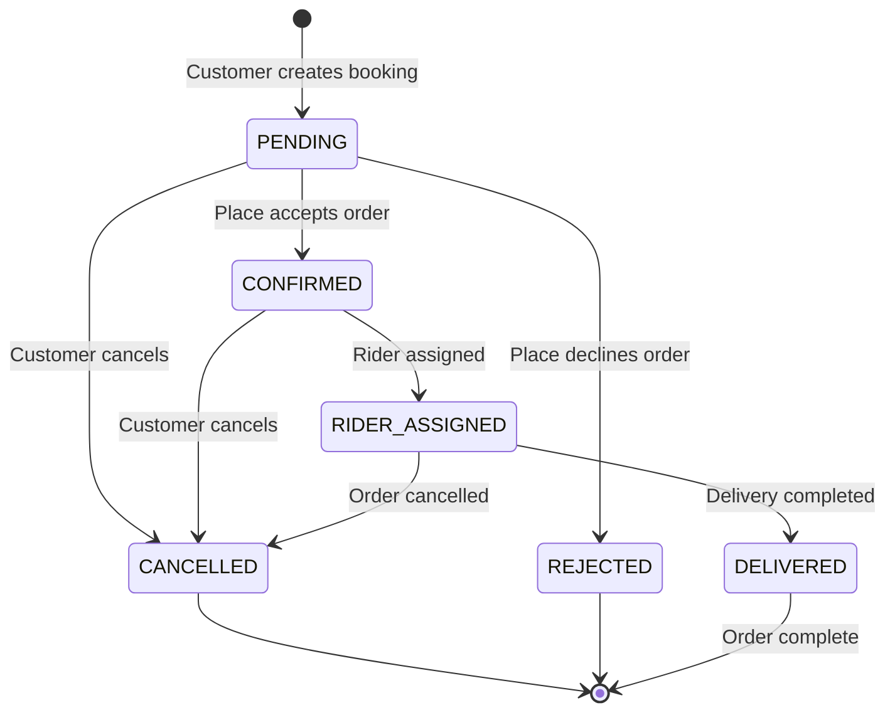

## Overview

Bookings represent orders placed by customers for products from restaurants, stores, or other places. The booking system manages the entire order lifecycle from creation through delivery, with distinct states tracking progress.

## Booking States

Defined in `utils/enums.ts:25-32`:

```typescript
export enum BookingState {
  PENDING = 'pending',
  CONFIRMED = 'confirmed',
  DELIVERED = 'delivered',
  CANCELLED = 'cancelled',
  REJECTED = 'rejected',
  RIDER_ASSIGNED = 'rider_assigned',
}
```

### State Diagram



## Booking Entity

From `bookings/entities/booking.entity.ts:8-63`:

```typescript
@Entity('bookings')
export class Booking extends AbstractEntity {
  @Column()
  total_amount: number;
  
  @Column({ default: 1 })
  quantity: number;
  
  @Column({ default: 0 })
  rider_tip: number;
  
  @Column({ default: 0 })
  delivery_fee: number;
  
  @Column()
  recipient_address: string;
  
  @Column({ default: false })
  paid: boolean;
  
  @Column()
  recipient_phone: string;
  
  @Column()
  transaction_id: string;
  
  @Column()
  reference_code: string;
  
  @Column({ nullable: true })
  receipt_url: string;
  
  @ManyToOne(() => BookingStatus, { eager: true })
  status: BookingStatus;
  
  @ManyToOne(() => User, { eager: true })
  user: User;
  
  @ManyToOne(() => Place, { eager: true })
  place: Place;
  
  @OneToMany(() => OrderedProducts, (product) => product.booking, {
    eager: true,
    onDelete: 'CASCADE'
  })
  services: OrderedProducts[];
}
```

### Key Fields

<Accordion title="Financial Fields">
  - **total_amount**: Total order cost including all items, fees, and tips
  - **delivery_fee**: Cost for delivery service
  - **rider_tip**: Optional gratuity for the delivery rider
  - **paid**: Boolean flag indicating payment completion
  - **transaction_id**: Payment gateway transaction identifier
</Accordion>

<Accordion title="Delivery Information">
  - **recipient_address**: Delivery destination address
  - **recipient_phone**: Contact number for delivery
  - **reference_code**: Unique booking identifier (format: `DPM-BK-XXXXXXXX`)
  - **receipt_url**: URL to downloadable order receipt
</Accordion>

<Accordion title="Relationships">
  - **status**: Current state (pending, confirmed, etc.)
  - **user**: Customer who placed the order
  - **place**: Restaurant/store fulfilling the order
  - **services**: Array of ordered products with quantities
</Accordion>

## Complete Workflow

### 1. Creating a Booking

From `bookings/bookings.service.ts:51-142`:

```typescript
async create(bookings: CreateBookingDto, user: User) {
  // Generate unique reference
  const reference = `DPM-BK-${generateOtpCode(8)}`;
  
  // Validate place is open
  const place = await this.placeService.findPlaceById(bookings.place);
  if (!isPlaceOpened(place?.openingHours)) {
    throw new BadRequestException(
      `${place?.name} is currently not accepting orders`
    );
  }
  
  // Create booking with PENDING status
  const newBooking = new Booking();
  newBooking.status = await this.getBookingByStatus(BookingState.PENDING);
  newBooking.user = user;
  newBooking.place = place;
  newBooking.reference_code = reference;
  // ... set other fields
  
  const savedBooking = await newBooking.save();
  
  // Create ordered products
  const orderProducts = await Promise.all(
    services.map(async (service) => {
      const product = await this.productsService.findProductById(
        service.product
      );
      return this.orderedProductRepository.create({
        product,
        quantity: service.quantity,
        booking: savedBooking,
      });
    })
  );
  
  // Generate receipt PDF
  await this.filesService.createBookingReceipt({
    ...bookings,
    reference,
    place: [place],
    id: savedBooking.id,
  });
  
  return { message: 'booking recorded successfully!!' };
}
```

#### Request Example

```json
POST /bookings
{
  "place": "uuid-of-restaurant",
  "services": [
    {
      "product": "uuid-of-product-1",
      "quantity": 2
    },
    {
      "product": "uuid-of-product-2",
      "quantity": 1
    }
  ],
  "delivery_address": "123 Main St, Accra",
  "recipient_phone": "+233123456789",
  "total_amount": 125.50,
  "delivery_fee": 15.00,
  "rider_tip": 5.00,
  "transaction_id": "TXN-12345"
}
```

<Warning>
  Bookings can only be created when the place is open. The system validates opening hours before accepting the order.
</Warning>

### 2. Place Confirmation

Place admins review and confirm or reject pending bookings:

```typescript
PATCH /bookings/:id/status
{
  "status": "confirmed"
}
```

From `bookings/bookings.service.ts:247-264`:

```typescript
async changeBookingStatus(id: string, status: string, user: User) {
  const [booking, bookingStatus] = await Promise.all([
    this.findBookingById(id),
    this.getBookingByStatus(status),
  ]);
  
  // Authorization checks
  if (user.role.name === UserRoles.USER && booking.user.id !== user.id) {
    throw new ForbiddenException();
  }
  
  if (
    user.role.name === UserRoles.PLACE_ADMIN &&
    booking.place.id === user.adminFor.id
  ) {
    throw new ForbiddenException();
  }
  
  booking.status = bookingStatus;
  return await booking.save();
}
```

<Note>
  Only place admins for the specific restaurant or system admins can confirm/reject bookings.
</Note>

### 3. Rider Assignment

Once confirmed, an admin assigns a delivery rider:

```typescript
POST /bookings/:id/assign-rider
{
  "riderId": "uuid-of-rider"
}
```

The booking status transitions to `RIDER_ASSIGNED`. The rider receives an SMS notification with:
- Order details
- Delivery address
- Customer contact
- Expected delivery time

### 4. Delivery Completion

The rider marks the booking as delivered:

```typescript
PATCH /bookings/:id/status
{
  "status": "delivered"
}
```

Final state reached - the booking is complete.

### 5. Rating & Review

After delivery, customers can rate their experience from `bookings/bookings.service.ts:322-369`:

```typescript
POST /bookings/:id/rate
{
  "rating": 5,
  "comment": "Great food, fast delivery!"
}
```

```typescript
async rateBooking(user: User, { comment, rating }: RatePlaceDto, id: string) {
  const booking = await this.findBookingById(id);
  
  // Prevent duplicate ratings
  const alreadyRated = await this.reviewsRepository.exists({
    where: {
      booking: { id },
      user: { id: user.id },
    },
  });
  
  if (alreadyRated) {
    throw new BadRequestException('You have already rated this booking');
  }
  
  // Update place rating average
  if (booking.place) {
    const placeRatingCount = await this.reviewsRepository.countBy({
      booking: { place: { id: booking.place.id } },
    });
    
    booking.place.rating = booking.place.rating
      ? (booking.place.rating * placeRatingCount + rating) / (placeRatingCount + 1)
      : rating;
    
    booking.place.total_reviews = placeRatingCount + 1;
    await booking.place.save();
  }
  
  // Create review
  const review = new Review();
  review.user = user;
  review.booking = booking;
  review.comment = comment;
  review.rating = rating;
  review.date = new Date();
  
  return await review.save();
}
```

<Note>
  Ratings contribute to the place's overall rating average and total review count.
</Note>

## Cancellation Flow

### Customer Cancellation

Customers can cancel their own bookings:

```typescript
DELETE /bookings/:id
```

From `bookings/bookings.service.ts:266-280`:

```typescript
async remove(id: string, user: User) {
  const booking = await this.findBookingById(id);
  
  if (!booking) {
    throw new NotFoundException('Booking not found');
  }
  
  // Only the booking owner can delete
  if (user.role.name === UserRoles.USER && user.id !== booking.user.id) {
    throw new ForbiddenException('You can only delete your own bookings');
  }
  
  const result = await this.bookingRepository.delete(booking.id);
  
  if (result.affected) {
    return { success: true };
  }
  
  throw new BadRequestException('Failed to delete booking');
}
```

### Rejection by Place

Place admins can reject bookings by changing status to `REJECTED`:

```typescript
PATCH /bookings/:id/status
{
  "status": "rejected"
}
```

<Warning>
  Cancellations should trigger refund processing if payment was already collected. Ensure your payment integration handles refunds appropriately.
</Warning>

## Querying Bookings

From `bookings/bookings.service.ts:144-202`, the API supports advanced filtering:

```typescript
GET /bookings?status=confirmed&from=2024-01-01&to=2024-01-31&place=uuid&page=1&limit=20
```

### Available Filters

- **status**: Filter by booking state (pending, confirmed, delivered, etc.)
- **place**: Filter by specific restaurant/store
- **category**: Filter by place category
- **from/to**: Date range filter
- **query**: Search term
- **page/limit**: Pagination parameters

```typescript
async findAll(queries: IFindBookingQuery) {
  const {
    status,
    page = 1,
    limit = 10,
    category,
    from,
    to,
    query,
    place,
  } = queries;
  
  const searchWhereClause: object = {};
  
  // Apply filters
  if (place) {
    if (category) {
      Object.assign(searchWhereClause, {
        place: { id: place, category: { id: category } },
      });
    } else {
      Object.assign(searchWhereClause, { place: { id: place } });
    }
  }
  
  if (status) {
    Object.assign(searchWhereClause, { status: { label: status } });
  }
  
  // Date range validation
  if ((from && !to) || (to && !from)) {
    throw new BadRequestException('Invalid date range');
  }
  
  if (from && to && isValidDateString(from) && isValidDateString(to)) {
    Object.assign(searchWhereClause, {
      createdAt: Between(new Date(from), new Date(to)),
    });
  }
  
  return paginate(this.bookingRepository, { page, limit }, {
    where: searchWhereClause,
    order: { createdAt: 'DESC' },
  });
}
```

## Analytics

### Sales by Year

From `bookings/bookings.service.ts:289-320`:

```typescript
GET /bookings/analytics/sales?year=2024
```

```typescript
async getBookingsByYear(year?: number) {
  const currentYear = new Date().getFullYear();
  year = year || currentYear;
  
  const startDate = new Date(`${year}-01-01T00:00:00Z`);
  const endDate = new Date(`${year}-12-31T23:59:59Z`);
  
  const sales = await this.bookingRepository
    .createQueryBuilder('bookings')
    .select("DATE_TRUNC('month', bookings.createdAt) AS month")
    .addSelect('SUM(bookings.total_amount) AS totalAmount')
    .where('bookings.createdAt >= :startDate', { startDate })
    .andWhere('bookings.createdAt <= :endDate', { endDate })
    .groupBy('month')
    .orderBy('month', 'ASC')
    .getRawMany();
  
  return sales;
}
```

Returns monthly aggregated sales data:

```json
[
  {
    "month": "2024-01-01T00:00:00.000Z",
    "totalAmount": "15420.50"
  },
  {
    "month": "2024-02-01T00:00:00.000Z",
    "totalAmount": "18350.75"
  }
]
```

## Receipt Generation

Bookings automatically generate PDF receipts via `filesService.createBookingReceipt()`. The receipt includes:

- Booking reference code
- Order details and items
- Customer information
- Delivery address
- Total breakdown (subtotal, delivery fee, tip)
- Place information

Receipts are stored and accessible via the `receipt_url` field.

## Best Practices

<Accordion title="Validate Place Hours">
  Always check if a place is accepting orders before creating bookings:
  
  ```typescript
  if (!isPlaceOpened(place?.openingHours)) {
    throw new BadRequestException(
      `${place?.name} is currently not accepting orders`
    );
  }
  ```
</Accordion>

<Accordion title="Transaction Safety">
  Use database transactions for operations that modify multiple tables:
  
  ```typescript
  const queryRunner = this.dataSource.createQueryRunner();
  await queryRunner.connect();
  await queryRunner.startTransaction();
  
  try {
    await queryRunner.manager.save(booking);
    await queryRunner.manager.save(orderedProducts);
    await queryRunner.commitTransaction();
  } catch (error) {
    await queryRunner.rollbackTransaction();
    throw error;
  } finally {
    await queryRunner.release();
  }
  ```
</Accordion>

<Accordion title="Authorization">
  Always verify user permissions before allowing status changes:
  
  ```typescript
  // Users can only modify their own bookings
  if (user.role.name === UserRoles.USER && booking.user.id !== user.id) {
    throw new ForbiddenException();
  }
  
  // Place admins can only modify their place's bookings
  if (
    user.role.name === UserRoles.PLACE_ADMIN &&
    booking.place.id !== user.adminFor.id
  ) {
    throw new ForbiddenException();
  }
  ```
</Accordion>

## State Transition Rules

| From State | Allowed Transitions | Allowed By |
|------------|-------------------|------------|
| PENDING | CONFIRMED, REJECTED, CANCELLED | Place Admin, User (cancel only) |
| CONFIRMED | RIDER_ASSIGNED, CANCELLED | Admin, User (cancel only) |
| RIDER_ASSIGNED | DELIVERED, CANCELLED | Rider, Admin |
| DELIVERED | None (terminal state) | - |
| CANCELLED | None (terminal state) | - |
| REJECTED | None (terminal state) | - |

<Warning>
  Attempting invalid state transitions will result in errors. Always follow the allowed transition paths.
</Warning>

## Next Steps

<CardGroup cols={2}>
  <Card title="Shipment Tracking" icon="map-marker" href="/concepts/shipment-tracking">
    Learn about parcel delivery tracking
  </Card>
  <Card title="User Roles" icon="shield" href="/concepts/user-roles">
    Understand role-based permissions
  </Card>
  <Card title="Bookings API" icon="code" href="/api/bookings/create">
    API reference for booking operations
  </Card>
  <Card title="Places API" icon="store" href="/api/places/management">
    Browse available places and products
  </Card>
</CardGroup>