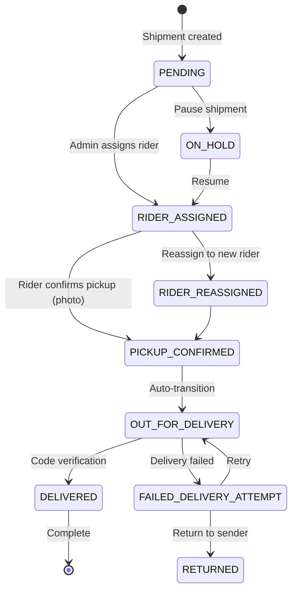

## Overview

The shipment tracking system handles parcel delivery orders, distinct from restaurant bookings. It provides comprehensive tracking capabilities through status updates, history logging, and real-time notifications.

## Shipment vs Booking

<CardGroup cols={2}>
  <Card title="Bookings" icon="utensils">
    Food and product orders from restaurants/stores with specific items and quantities
  </Card>
  <Card title="Shipments" icon="box">
    Parcel delivery from point A to point B without specific product catalogs
  </Card>
</CardGroup>

## Shipment Entity

From `shipping/entities/shipping-order.entity.ts:20-80`:

```typescript
@Entity('shipping_orders')
export class ShippingOrder extends AbstractEntity {
  @Column()
  pickupCity: string;
  
  @Column()
  pickupArea: string;
  
  @Column()
  senderPhone: string;
  
  @Column({ nullable: true })
  pickupDate: Date;
  
  @Column()
  dropOffArea: string;
  
  @Column()
  dropOffCity: string;
  
  @Column()
  recipientPhone: string;
  
  @Column({ nullable: true })
  dropOffDate: Date;
  
  @Column({ nullable: true })
  extraInformation: string;
  
  @Column()
  shipmentOption: ShipmentOptions;
  
  @Column()
  modeOfShipment: ModeOfShipment;
  
  @Column()
  status: ShipmentHistoryStatus;
  
  @Column()
  @Index('reference_idx')
  reference: string;
  
  @Column({ nullable: true })
  @Index('confirmation_code_idx')
  confirmationCode: string;
  
  @ManyToOne(() => User, (rider) => rider.shippingOrders)
  rider: User;
  
  @OneToMany(() => ShipmentHistory, (history) => history.order, {
    cascade: true,
  })
  history: ShipmentHistory[];
  
  @OneToOne(() => ShipmentCost, { eager: true })
  @JoinColumn()
  shipmentCost: ShipmentCost;
  
  @ManyToOne(() => User, (user) => user.markedAsPaidOrders)
  markedAsPaidBy: User;
}
```

## Shipment Options

From `utils/enums.ts:34-45`:

```typescript
export enum ShipmentOptions {
  STANDARD = 'standard_delivery',
  EXPRESS = 'express_delivery',
  SPECIAL = 'special_delivery',
  BULK = 'bulk_delivery',
}

export enum ModeOfShipment {
  Bike = 'Bike',
  Aboboyaa = 'Aboboyaa',
  Van = 'Van',
}
```

<Accordion title="Shipment Options Explained">
  - **STANDARD**: Regular delivery within standard timeframes
  - **EXPRESS**: Priority delivery with faster service
  - **SPECIAL**: Delicate or specialized items requiring extra care
  - **BULK**: Large volume deliveries
</Accordion>

<Accordion title="Transport Modes">
  - **Bike**: Motorcycle delivery for small parcels
  - **Aboboyaa**: Three-wheeled vehicle for medium loads
  - **Van**: Full van for bulk or large items
</Accordion>

## Shipment Status Lifecycle

From `utils/enums.ts:61-77`:

```typescript
export enum ShipmentHistoryStatus {
  PENDING = 'pending',
  RIDER_ASSIGNED = 'rider_assigned',
  PICKUP_CONFIRMED = 'pickup_confirmed',
  OUT_FOR_DELIVERY = 'out_for_delivery',
  DELIVERED = 'delivered',
  FAILED_DELIVERY_ATTEMPT = 'failed_delivery_attempt',
  RIDER_REASSIGNED = 'rider_reassigned',
  PAYMENT_RECEIVED = 'payment_received',
  RETURNED = 'returned',
  ON_HOLD = 'on_hold',
  REPACKAGED = 'repackaged',
  IN_TRANSIT = 'in_transit',
  ARRIVED = 'arrived',
  READY_FOR_PICKUP = 'ready_for_pickup',
  REFUNDED = 'refunded',
}
```

### Status Flow Diagram



## Creating a Shipment

From `shipping/shipping.service.ts:46-83`:

```typescript
POST /shipments
{
  "pickupCity": "Accra",
  "pickupArea": "Osu",
  "senderPhone": "+233123456789",
  "dropOffCity": "Accra",
  "dropOffArea": "Tema",
  "recipientPhone": "+233987654321",
  "shipmentOption": "express_delivery",
  "modeOfShipment": "Bike",
  "extraInformation": "Fragile - handle with care"
}
```

```typescript
async create(createShipmentDto: CreateShipmentDto) {
  const queryRunner = this.dataSource.createQueryRunner();
  await queryRunner.connect();
  await queryRunner.startTransaction();
  
  try {
    // Generate unique reference
    const serviceType = 'PD'; // Parcel Delivery
    const reference = generateBookingReference(serviceType);
    
    // Create shipment with PENDING status
    const shipment = this.shippingOrderRepository.create({
      ...createShipmentDto,
      status: ShipmentHistoryStatus.PENDING,
      reference,
    });
    
    await queryRunner.manager.save(shipment);
    
    // Send tracking notification to recipient
    const trackingLink = `${ENV.FRONTEND_URL}/track-delivery/${reference}`;
    await this.messageService.sendSms(
      MessagesTemplates.SHIPMENT_RECEIVED,
      {
        reference,
        trackLink: trackingLink,
        recipients: [createShipmentDto.recipientPhone],
      }
    );
    
    // Notify admin of new order
    await this.messageService.sendSms(
      MessagesTemplates.NEW_ORDER_RECEIVED,
      {
        recipients: [ENV.ADMIN_PHONE_NUMBER],
      }
    );
    
    await queryRunner.commitTransaction();
    return shipment;
  } catch (error) {
    await queryRunner.rollbackTransaction();
    throw error;
  } finally {
    await queryRunner.release();
  }
}
```

<Note>
  Shipments are created with status `PENDING` and automatically generate a unique reference code (e.g., `PD-20240315-XXXX`).
</Note>

## Tracking a Shipment

### By Reference Code

```typescript
GET /shipments/track/:reference
```

From `shipping/shipping.service.ts:162-177`:

```typescript
async findByReference(reference: string) {
  const order = await this.shippingOrderRepository.findOne({
    where: { reference },
    relations: ['rider', 'history'],
    order: {
      history: {
        createdAt: 'DESC',
      },
    },
  });
  
  if (!order) {
    throw new NotFoundException('Order not found');
  }
  
  return order;
}
```

### Response Example

```json
{
  "id": "uuid",
  "reference": "PD-20240315-1234",
  "status": "out_for_delivery",
  "pickupCity": "Accra",
  "pickupArea": "Osu",
  "dropOffCity": "Accra",
  "dropOffArea": "Tema",
  "shipmentOption": "express_delivery",
  "modeOfShipment": "Bike",
  "confirmationCode": "1234",
  "rider": {
    "id": "uuid",
    "fullName": "John Doe",
    "phone": "+233123456789"
  },
  "history": [
    {
      "id": "uuid",
      "status": "out_for_delivery",
      "description": "Package is on the way",
      "createdAt": "2024-03-15T10:30:00Z",
      "data": {}
    },
    {
      "id": "uuid",
      "status": "pickup_confirmed",
      "description": "Package picked up from sender",
      "createdAt": "2024-03-15T09:15:00Z",
      "data": {
        "photo": "https://cdn.example.com/pickup-photo.jpg"
      }
    }
  ],
  "createdAt": "2024-03-15T08:00:00Z"
}
```

## Rider Assignment

From `shipping/shipping.service.ts:179-260`:

```typescript
POST /shipments/:id/assign-rider
{
  "riderId": "uuid-of-rider"
}
```

```typescript
async assignRider(id: string, riderId: string) {
  const queryRunner = this.dataSource.createQueryRunner();
  await queryRunner.connect();
  await queryRunner.startTransaction();
  
  try {
    const order = await this.findOne(id);
    
    // Prevent duplicate assignment
    if (order.rider && order.rider.id === riderId) {
      throw new BadRequestException(
        'Rider is already assigned to this order'
      );
    }
    
    // Validate rider
    const rider = await this.userService.findRiderById(riderId);
    if (!rider.isVerified) {
      throw new BadRequestException('Rider is not verified');
    }
    
    const history = new ShipmentHistory();
    
    // Handle reassignment
    if (order.rider && order.rider.id !== riderId) {
      // Notify old rider
      await this.messageService.sendSms(
        MessagesTemplates.RIDER_REASSIGNED,
        {
          fullName: order.rider.fullName,
          reference: order.reference,
          recipients: [order.rider.phone],
        }
      );
      
      history.status = ShipmentHistoryStatus.RIDER_REASSIGNED;
      history.data = {
        old_rider_id: order.rider.id,
        old_rider_name: order.rider.fullName,
        new_rider_id: riderId,
        new_rider_name: rider.fullName,
      };
      order.status = ShipmentHistoryStatus.RIDER_REASSIGNED;
    } else {
      // First assignment
      history.status = ShipmentHistoryStatus.RIDER_ASSIGNED;
      history.data = {
        rider_id: riderId,
        rider_name: rider.fullName,
      };
      order.status = ShipmentHistoryStatus.RIDER_ASSIGNED;
    }
    
    order.rider = rider;
    
    // Notify new rider
    await this.messageService.sendSms(
      MessagesTemplates.RIDER_ASSIGNED,
      {
        orderNumber: order.reference,
        fullName: rider.fullName,
        deliveryArea: `${order.dropOffCity}, ${order.dropOffArea}`,
        contactNumber: order.recipientPhone,
        dashboardLink: `${ENV.DASHBOARD_URL}`,
        recipients: [rider.phone],
        fee: order.shipmentCost.totalCost,
      }
    );
    
    // Notify customer
    await this.messageService.sendSms(
      MessagesTemplates.RIDER_ASSIGNED_USER,
      {
        reference: order.reference,
        recipients: [rider.phone],
      }
    );
    
    const savedOrder = await this.shippingOrderRepository.save(order);
    history.order = savedOrder;
    await this.shipmentHistoryRepository.save(history);
    
    await queryRunner.commitTransaction();
    return savedOrder;
  } catch (error) {
    await queryRunner.rollbackTransaction();
    throw error;
  } finally {
    await queryRunner.release();
  }
}
```

<Warning>
  Only verified riders can be assigned to shipments. The system validates `rider.isVerified` before allowing assignment.
</Warning>

## Shipment History Updates

From `shipping/shipping.service.ts:262-419`:

### Pickup Confirmation

```typescript
PATCH /shipments/:id/history
Content-Type: multipart/form-data

{
  "status": "pickup_confirmed",
  "description": "Package collected from sender",
  "photo": <file>
}
```

```typescript
case ShipmentHistoryStatus.PICKUP_CONFIRMED:
  if (!photo) {
    throw new BadRequestException(
      'Photo is required for pickup confirmation'
    );
  }
  
  const upload = await this.filesService.uploadImage(photo);
  data = {
    photo: upload.url,
    status: createShipmentHistoryDto.status,
  };
  break;
```

<Note>
  Pickup confirmation requires photographic evidence. The photo is uploaded and stored in the history data.
</Note>

### Out for Delivery

```typescript
PATCH /shipments/:id/history
{
  "status": "out_for_delivery",
  "description": "Package is on the way to recipient"
}
```

```typescript
case ShipmentHistoryStatus.OUT_FOR_DELIVERY:
  // Generate 4-digit confirmation code
  const confirmationCode = generateOtpCode(4);
  order.confirmationCode = confirmationCode;
  
  // Send code to recipient
  smsToSend = {
    template: MessagesTemplates.OUT_FOR_DELIVERY,
    params: {
      reference: order.reference,
      recipients: [order.recipientPhone],
      code: confirmationCode,
      trackingLink: `${ENV.FRONTEND_URL}/track-delivery/${order.reference}`,
      totalCost: shipmentCost.totalCost,
    },
  };
  break;
```

<Note>
  When marked "out for delivery", a 4-digit confirmation code is generated and sent to the recipient via SMS.
</Note>

### Delivery Completion

```typescript
PATCH /shipments/:id/history
{
  "status": "delivered",
  "confirmationCode": "1234",
  "isPaid": "true"
}
```

```typescript
case ShipmentHistoryStatus.DELIVERED:
  if (!createShipmentHistoryDto.confirmationCode) {
    throw new BadRequestException(
      'Confirmation code is required for delivery confirmation'
    );
  }
  
  // Verify confirmation code
  if (order.confirmationCode !== createShipmentHistoryDto.confirmationCode) {
    throw new BadRequestException('Confirmation code is incorrect!');
  }
  
  if (!shipmentCost) {
    throw new BadRequestException(
      'There is no cost set for this order'
    );
  }
  
  const isPaid = createShipmentHistoryDto.isPaid === 'true';
  if (!shipmentCost.paid && !isPaid) {
    throw new BadRequestException(
      'Shipment cost is not paid, please verify the payment'
    );
  }
  
  // Calculate rider commission
  let riderPayment = 0;
  if (shipmentCost.riderCommission > 0) {
    riderPayment = (shipmentCost.riderCommission / 100) * shipmentCost.totalCost;
  }
  
  // Credit rider wallet
  await this.walletService.creditWallet(
    order.rider.id,
    riderPayment,
    order.reference,
  );
  
  // Clear confirmation code
  order.confirmationCode = null;
  
  // Notify recipient
  smsToSend = {
    template: MessagesTemplates.DELIVERED,
    params: {
      reference: order.reference,
      recipients: [order.recipientPhone],
    },
  };
  break;
```

<Accordion title="Delivery Verification Process">
  1. Rider reaches delivery location
  2. Recipient provides the 4-digit confirmation code
  3. Rider enters code in the app
  4. System verifies code matches the one sent to recipient
  5. Payment verification (if COD)
  6. Rider commission calculated and credited to wallet
  7. Status updated to DELIVERED
  8. Confirmation SMS sent to recipient
</Accordion>

## Shipment History Entity

From `shipping/entities/shipment-history.entity.ts:6-37`:

```typescript
@Entity('shipment_history')
export class ShipmentHistory extends AbstractEntity {
  @Column()
  status: ShipmentHistoryStatus;
  
  @Column({ nullable: true })
  description: string;
  
  @Column('json', { default: {} })
  data: ShipmentHistoryData;
  
  @ManyToOne(() => ShippingOrder, (order) => order.history)
  order: ShippingOrder;
}

export type ShipmentHistoryData =
  | {
      status: ShipmentHistoryStatus.PICKUP_CONFIRMED;
      photo: string;
    }
  | {
      old_rider_id: string;
      old_rider_name: string;
      new_rider_id: string;
      new_rider_name: string;
    }
  | {
      rider_id: string;
      rider_name: string;
    }
  | Record<string, unknown>;
```

The `data` field stores status-specific metadata:
- **PICKUP_CONFIRMED**: Photo URL
- **RIDER_REASSIGNED**: Old and new rider details
- **RIDER_ASSIGNED**: Rider details

## Filtering Shipments

From `shipping/shipping.service.ts:85-122`:

```typescript
GET /shipments?status=out_for_delivery&query=PD-2024&page=1&limit=20
```

```typescript
async findAll(options: FindAllShipmentDto, user: User) {
  const { status, query, ...rest } = options;
  let where: any = [];
  
  const isRider = user.role.name === UserRoles.COURIER;
  
  // Riders only see their assigned orders
  if (isRider) {
    where = [{ rider: { id: user.id } }];
  }
  
  // Search by reference or rider name
  if (query) {
    where = [
      {
        reference: query,
        ...(status ? { status } : {}),
        ...{ rider: isRider ? { id: user.id } : {} },
      },
      {
        rider: isRider 
          ? { id: user.id } 
          : { fullName: ILike(`%${query}%`) },
        ...(status ? { status } : {}),
      },
    ];
  }
  
  // Filter by status
  if (status && !query) {
    where = [{ 
      status, 
      ...{ rider: isRider ? { id: user.id } : {} } 
    }];
  }
  
  return paginate(this.shippingOrderRepository, rest, {
    where,
    order: { createdAt: 'DESC' },
  });
}
```

<Note>
  Riders automatically see only their assigned shipments. Admins can view all shipments.
</Note>

## Rider Statistics

From `shipping/shipping.service.ts:454-502`:

```typescript
GET /shipments/riders/:riderId/stats
```

```typescript
async getRiderStats(riderId: string) {
  const startOfDay = new Date();
  startOfDay.setHours(0, 0, 0, 0);
  const endOfDay = new Date();
  endOfDay.setHours(23, 59, 59, 999);
  
  const [delivered, cancelled, todayDelivered, assigned] = await Promise.all([
    // Total completed deliveries
    this.shippingOrderRepository.count({
      where: {
        rider: { id: riderId },
        status: ShipmentHistoryStatus.DELIVERED,
      },
    }),
    
    // Total cancelled/on-hold
    this.shippingOrderRepository.count({
      where: {
        rider: { id: riderId },
        status: ShipmentHistoryStatus.ON_HOLD,
      },
    }),
    
    // Deliveries completed today
    this.shippingOrderRepository.count({
      where: {
        rider: { id: riderId },
        status: ShipmentHistoryStatus.DELIVERED,
        updatedAt: Between(startOfDay, endOfDay),
      },
    }),
    
    // Currently assigned (not completed or out)
    this.shippingOrderRepository.count({
      where: {
        rider: { id: riderId },
        status: Not(In([
          ShipmentHistoryStatus.DELIVERED,
          ShipmentHistoryStatus.OUT_FOR_DELIVERY,
        ])),
      },
    }),
  ]);
  
  return {
    total_orders_delivered: delivered,
    total_orders_cancelled: cancelled,
    total_deliveries_today: todayDelivered,
    total_orders_assigned: assigned,
  };
}
```

## SMS Notifications

The system sends automated SMS notifications at key milestones:

<Accordion title="Notification Templates">
  From `utils/enums.ts:47-59`:
  
  ```typescript
  export const enum MessagesTemplates {
    SHIPMENT_RECEIVED = 'shipment_received',
    SHIPMENT_RECEIVED_RECEIVER = 'shipment_received_receiver',
    RIDER_ASSIGNED = 'rider_assigned',
    RIDER_ASSIGNED_USER = 'rider_assigned_user',
    RIDER_REASSIGNED = 'rider_reassigned',
    NEW_ORDER_RECEIVED = 'new_order_received',
    OUT_FOR_DELIVERY = 'out_for_delivery',
    DELIVERED = 'delivered',
  }
  ```
  
  - **SHIPMENT_RECEIVED**: Sent to customer with tracking link
  - **NEW_ORDER_RECEIVED**: Sent to admin when new shipment created
  - **RIDER_ASSIGNED**: Sent to rider with delivery details
  - **RIDER_ASSIGNED_USER**: Sent to customer when rider assigned
  - **RIDER_REASSIGNED**: Sent to previous rider on reassignment
  - **OUT_FOR_DELIVERY**: Sent to customer with confirmation code
  - **DELIVERED**: Sent to customer on successful delivery
</Accordion>

## Payment & Commission

### Shipment Cost

Each shipment has an associated `ShipmentCost` entity:

```typescript
@Entity('shipment_cost')
export class ShipmentCost {
  @Column('decimal', { precision: 10, scale: 2 })
  totalCost: number;
  
  @Column('decimal', { precision: 5, scale: 2 })
  riderCommission: number; // Percentage (e.g., 15.00 = 15%)
  
  @Column({ default: false })
  paid: boolean;
  
  @Column({ nullable: true })
  paidAt: Date;
}
```

### Commission Calculation

```typescript
let riderPayment = 0;
if (shipmentCost.riderCommission > 0) {
  riderPayment = (shipmentCost.riderCommission / 100) * shipmentCost.totalCost;
}

riderPayment = parseFloat(riderPayment.toFixed(2));

await this.walletService.creditWallet(
  order.rider.id,
  riderPayment,
  order.reference,
);
```

Example: If total cost is GHS 50 and commission is 15%, rider earns GHS 7.50.

## Best Practices

<Warning>
  Always validate that shipment cost is set before allowing "out for delivery" status:
  
  ```typescript
  if (!shipmentCost && status === ShipmentHistoryStatus.OUT_FOR_DELIVERY) {
    throw new BadRequestException('There is no cost set for this order');
  }
  ```
</Warning>

<Note>
  Use database transactions for multi-step operations like rider assignment to ensure data consistency.
</Note>

<Accordion title="Status Validation">
  Prevent redundant status updates:
  
  ```typescript
  if (order.status === createShipmentHistoryDto.status) {
    throw new BadRequestException(
      'Order status is the same as the previous status'
    );
  }
  ```
</Accordion>

<Accordion title="Terminal State Protection">
  Once delivered, prevent further updates:
  
  ```typescript
  if (order.status === ShipmentHistoryStatus.DELIVERED) {
    throw new BadRequestException('Order is already delivered');
  }
  ```
</Accordion>

## Next Steps

<CardGroup cols={2}>
  <Card title="Booking Workflow" icon="sitemap" href="/concepts/booking-workflow">
    Learn about restaurant order management
  </Card>
  <Card title="Wallet System" icon="wallet" href="/api/wallets/overview">
    Understand rider earnings and payouts
  </Card>
  <Card title="Shipping API" icon="code" href="/api/shipping/create-shipment">
    API reference for shipment operations
  </Card>
  <Card title="Rider Management" icon="motorcycle" href="/api/riders/management">
    Manage rider accounts and assignments
  </Card>
</CardGroup>