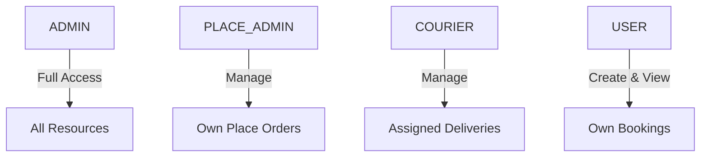

## Overview

The DPM Delivery API implements a role-based access control (RBAC) system with four distinct user roles. Each role has specific permissions that determine what actions users can perform and what data they can access.

## Role Types

Defined in `utils/enums.ts:1-6`:

```typescript
export const enum UserRoles {
  ADMIN = 'Admin',
  USER = 'User',
  PLACE_ADMIN = 'Place Admin',
  COURIER = 'Rider',
}
```

### Role Hierarchy



## Role Details

<Accordion title="ADMIN - Platform Administrator">
  ### Permissions
  
  Administrators have unrestricted access to all platform features:
  
  - **User Management**: Create, update, delete, and verify all user accounts
  - **Place Management**: Manage all restaurants, stores, and their products
  - **Order Management**: View, modify, and manage all bookings and shipments
  - **Rider Management**: Assign riders, manage rider profiles, approve verifications
  - **Financial Operations**: 
    - View all wallet balances and transactions
    - Approve/reject payout requests
    - Mark shipments as paid
    - Access analytics and revenue reports
  - **System Configuration**: Manage variables, payment methods, and system settings
  
  ### Common Use Cases
  
  ```typescript
  // Admin-only endpoint example
  @Get('analytics/revenue')
  @UseGuards(JwtAuthGuard, RolesGuard)
  @hasRoles(UserRoles.ADMIN)
  getRevenue(@Query() params: DateRangeDto) {
    return this.analyticsService.getRevenue(params);
  }
  ```
  
  ### Special Privileges
  
  - Receive SMS notifications for new orders (`shipping.service.ts:71-73`)
  - Can reassign riders to different shipments
  - Access to all database records regardless of ownership
  
  <Warning>
    Admin role should only be assigned to trusted platform operators as it grants complete system access.
  </Warning>
</Accordion>

<Accordion title="USER - Customer">
  ### Permissions
  
  Regular users can interact with the platform as customers:
  
  - **Bookings**: 
    - Create new bookings/orders from places (`bookings.service.ts:51-142`)
    - View their own booking history
    - Cancel their own pending bookings
    - Rate and review completed bookings
  - **Shipments**: 
    - Create parcel delivery requests
    - Track shipment status via reference code
  - **Profile**: 
    - Update personal information
    - Change password
    - View order receipts
  
  ### Access Restrictions
  
  From `bookings.service.ts:252-255`:
  ```typescript
  if (user.role.name === UserRoles.USER && booking.user.id !== user.id) {
    throw new ForbiddenException();
  }
  ```
  
  Users can only access resources they own. Attempting to access another user's data will result in a `403 Forbidden` error.
  
  ### Example Workflow
  
  1. User browses available places and products
  2. User creates a booking with delivery details
  3. User receives booking confirmation and receipt
  4. User tracks order status
  5. User rates the experience upon delivery
  
  <Note>
    The `@hasRoles(UserRoles.USER)` decorator is used on endpoints that customers should access.
  </Note>
</Accordion>

<Accordion title="PLACE_ADMIN - Restaurant/Store Owner">
  ### Permissions
  
  Place admins manage their own restaurant or store:
  
  - **Place Management**: 
    - Update place details (name, address, hours)
    - Upload place images and banners
    - Manage opening hours
  - **Product Catalog**: 
    - Add, update, and delete products
    - Set product prices and availability
    - Manage product categories
  - **Order Management**: 
    - View bookings for their place only
    - Update booking status (pending → confirmed/rejected)
    - Access order details and customer information
  - **Analytics**: View sales and performance for their place
  
  ### Relationship to Places
  
  From `users/entities/user.entity.ts:56-58`:
  ```typescript
  @OneToOne(() => Place, { onDelete: 'CASCADE', eager: true })
  @JoinColumn()
  adminFor: Place;
  ```
  
  Each Place Admin is linked to exactly one place via the `adminFor` relationship.
  
  ### Access Control Example
  
  From `bookings.service.ts:257-261`:
  ```typescript
  if (
    user.role.name === UserRoles.PLACE_ADMIN &&
    booking.place.id === user.adminFor.id
  ) {
    throw new ForbiddenException();
  }
  ```
  
  Place admins can only modify bookings for their own establishment.
  
  ### Typical Operations
  
  ```typescript
  // Place admin updating their place
  @Patch('places/my-place')
  @UseGuards(JwtAuthGuard, RolesGuard)
  @hasRoles(UserRoles.PLACE_ADMIN)
  updateMyPlace(
    @Body() dto: UpdatePlaceDto,
    @CurrentUser() user: User
  ) {
    return this.placesService.update(user.adminFor.id, dto);
  }
  ```
</Accordion>

<Accordion title="COURIER - Delivery Rider">
  ### Permissions
  
  Couriers handle delivery logistics:
  
  - **Shipment Management**: 
    - View assigned shipments (`shipping.service.ts:89-93`)
    - Update shipment status:
      - Mark pickup as confirmed (with photo)
      - Set status to "out for delivery"
      - Complete delivery (with confirmation code)
    - View delivery history
  - **Wallet Operations**: 
    - View wallet balance and transaction history
    - Request payouts
    - Track earnings from completed deliveries
  - **Profile**: 
    - Update rider profile and documents
    - View delivery statistics
  
  ### Rider Assignment
  
  From `shipping.service.ts:179-260`, only verified riders can be assigned:
  ```typescript
  const rider = await this.userService.findRiderById(riderId);
  if (!rider.isVerified) {
    throw new BadRequestException('Rider is not verified');
  }
  ```
  
  ### Earnings Model
  
  From `shipping.service.ts:344-357`:
  ```typescript
  let riderPayment = 0;
  if (shipmentCost.riderCommission > 0) {
    riderPayment = (shipmentCost.riderCommission / 100) * shipmentCost.totalCost;
  }
  
  await this.walletService.creditWallet(
    order.rider.id,
    riderPayment,
    order.reference,
  );
  ```
  
  Riders earn a percentage commission on each completed delivery, credited to their wallet.
  
  ### Delivery Workflow
  
  1. Admin assigns shipment to rider
  2. Rider receives SMS notification (`shipping.service.ts:227-235`)
  3. Rider confirms pickup (uploads photo)
  4. Rider marks "out for delivery"
  5. Customer receives confirmation code
  6. Rider enters code to complete delivery
  7. Rider's wallet is credited with commission
  
  <Note>
    Riders can only view and manage shipments assigned to them. The query automatically filters by rider ID.
  </Note>
  
  ### Rider Statistics
  
  From `shipping.service.ts:454-502`, riders can access their performance metrics:
  - Total orders delivered
  - Total orders cancelled
  - Deliveries completed today
  - Currently assigned orders
</Accordion>

## Role Assignment

### Database Schema

Roles are stored in the `roles` table (`users/entities/role.entity.ts:10-24`):

```typescript
@Entity('roles')
export class Role extends BaseEntity {
  @PrimaryGeneratedColumn()
  id: number;
  
  @Column()
  name: string;
  
  @OneToMany(() => User, (user) => user.role)
  user: User[];
}
```

### User-Role Relationship

From `users/entities/user.entity.ts:51-52`:

```typescript
@ManyToOne(() => Role, (role) => role.user)
role: Role;
```

Each user has exactly one role, but multiple users can share the same role.

### Setting Roles

Roles are typically assigned during user creation:

```typescript
const user = new User();
user.fullName = 'John Doe';
user.phone = '+233123456789';

const userRole = await roleRepository.findOne({ 
  where: { name: UserRoles.USER } 
});
user.role = userRole;

await user.save();
```

## Implementing Role-Based Access

### Using the @hasRoles Decorator

From `auth/decorators/roles.decorator.ts:4-5`:

```typescript
export const hasRoles = (...hasRoles: UserRoles[]) =>
  SetMetadata('roles', hasRoles);
```

### Controller Example

```typescript
import { hasRoles } from 'src/auth/decorators/roles.decorator';
import { UserRoles } from 'src/utils/enums';

@Controller('shipments')
@UseGuards(JwtAuthGuard, RolesGuard)
export class ShippingController {
  // Only admins can assign riders
  @Post(':id/assign-rider')
  @hasRoles(UserRoles.ADMIN)
  assignRider(
    @Param('id') id: string,
    @Body() dto: AssignRiderDto,
  ) {
    return this.shippingService.assignRider(id, dto.riderId);
  }
  
  // Riders and admins can update shipment status
  @Patch(':id/status')
  @hasRoles(UserRoles.COURIER, UserRoles.ADMIN)
  updateStatus(
    @Param('id') id: string,
    @Body() dto: UpdateStatusDto,
    @CurrentUser() user: User,
  ) {
    return this.shippingService.updateHistory(user, dto, id);
  }
  
  // Anyone authenticated can track a shipment
  @Get('track/:reference')
  @hasRoles(UserRoles.USER, UserRoles.ADMIN, UserRoles.COURIER, UserRoles.PLACE_ADMIN)
  trackShipment(@Param('reference') reference: string) {
    return this.shippingService.findByReference(reference);
  }
}
```

### Accessing Current User

Use the `@CurrentUser()` decorator to access the authenticated user:

```typescript
import { CurrentUser } from 'src/auth/decorators/currentUser.decorator';

@Get('my-orders')
@UseGuards(JwtAuthGuard)
getMyOrders(@CurrentUser() user: User) {
  // user.role.name contains the role
  return this.bookingsService.findUserBookings(user.id);
}
```

## Permission Matrix

| Feature | ADMIN | PLACE_ADMIN | COURIER | USER |
|---------|-------|-------------|---------|------|
| Create Bookings | ✅ | ✅ | ❌ | ✅ |
| View All Bookings | ✅ | ❌ | ❌ | ❌ |
| Manage Own Place | ✅ | ✅ | ❌ | ❌ |
| Assign Riders | ✅ | ❌ | ❌ | ❌ |
| Update Shipment Status | ✅ | ❌ | ✅ | ❌ |
| View Wallet | ✅ | ❌ | ✅ | ❌ |
| Request Payout | ❌ | ❌ | ✅ | ❌ |
| Approve Payout | ✅ | ❌ | ❌ | ❌ |
| View Analytics | ✅ | ✅* | ❌ | ❌ |
| Manage Users | ✅ | ❌ | ❌ | ❌ |

*Place admins can only view analytics for their own place.

## Best Practices

<Warning>
  Always apply both `JwtAuthGuard` and `RolesGuard` together. Applying only `RolesGuard` without authentication will fail.
</Warning>

<Note>
  If no `@hasRoles()` decorator is present but `RolesGuard` is applied, the endpoint is accessible to all authenticated users (see `roles.guard.ts:17-19`).
</Note>

### Service-Level Authorization

While guards protect endpoints, services should also validate permissions:

```typescript
async deleteBooking(id: string, user: User) {
  const booking = await this.findBookingById(id);
  
  // Verify ownership
  if (user.role.name === UserRoles.USER && user.id !== booking.user.id) {
    throw new ForbiddenException('You can only delete your own bookings');
  }
  
  return this.bookingRepository.delete(id);
}
```

## Next Steps

<CardGroup cols={2}>
  <Card title="Architecture" icon="diagram-project" href="/concepts/architecture">
    Learn about the overall system architecture
  </Card>
  <Card title="Booking Workflow" icon="sitemap" href="/concepts/booking-workflow">
    Understand how bookings progress through states
  </Card>
  <Card title="Authentication" icon="key" href="/authentication">
    Learn how to obtain JWT tokens
  </Card>
  <Card title="User Management" icon="users-gear" href="/api/users/management">
    API reference for user operations
  </Card>
</CardGroup>